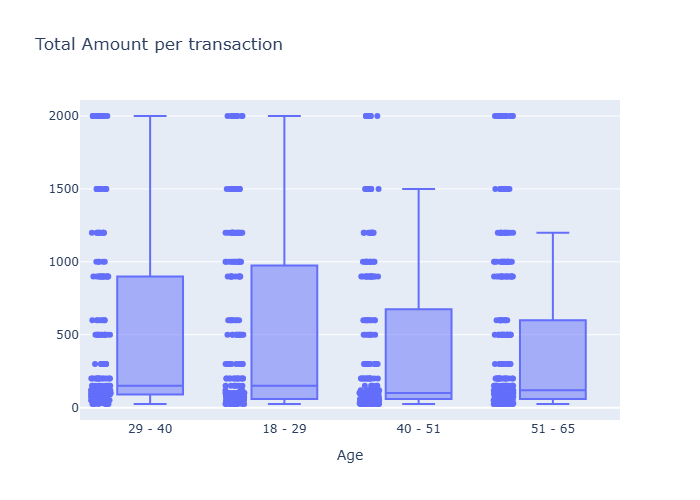
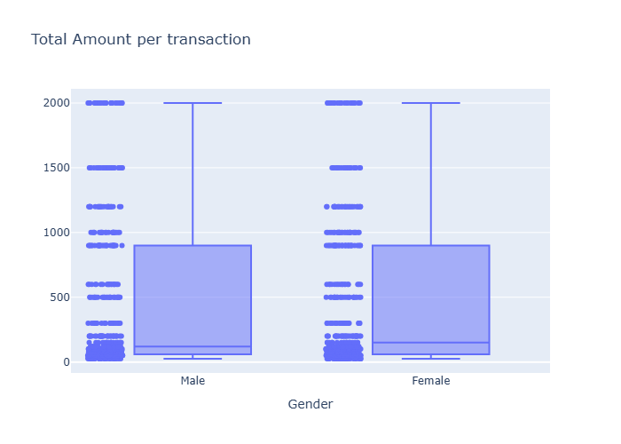
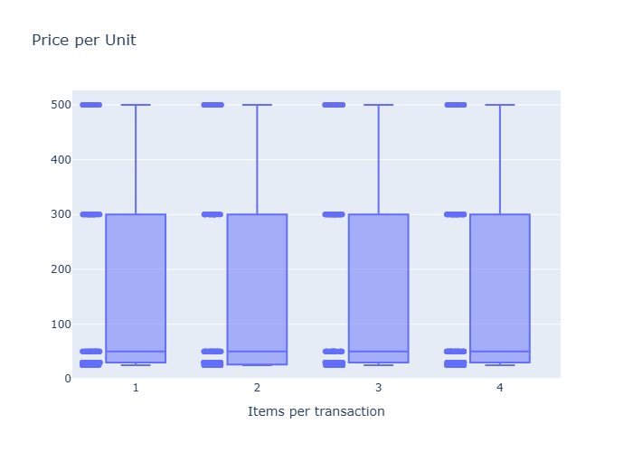

# Data Analysis of Retail Consumption

## Objective
Analyze a retail sales dataset to identify patterns of sales based on gender, age and number of items by transaction

## Source of Data
source: https://www.kaggle.com/datasets/mohammadtalib786/retail-sales-dataset.

Synthetic dataset that simulates a dynamic retail environment in one year. The dataset contains information about customer gender and age, trasaction date, number of items, unit price and total sales amount per transaction.

## Process

- Data review and cleaning.
- Transaction grouping by gender, interval age and number of purchased items by transaction.
- Application of Kruskal-Wallis test for each group to see possible behaviour in sales.
- Filter data by column Product Category values and see if there are variations in the results for each one.

## Results.
For the category of age and gender, the groups show us the same behaviour of sales (see Fig 1, 2). The Kruskal-Wallis test confirms that (H-value = 5.019 and p-value = 0.170 for age groups and H-value = 0.083 and p-value = 0.77) the variations between age groups and the variations between gender groups are not significant respect the data variability. Furthermore, we can see a important bias towards low purchase values.

  <em>
    Fig1: Total Amount vs Age; &nbsp;&nbsp; Fig2: Total Amount vs Gender
  </em>

In the same way, we don't see differences between the quantity of purchased products in the election of items to buy per transaction (see Fig 3). If the customer buys one product or two, he will prefer items of low cost. The bahaviour is the same for the three Category Products (Electronic, Clothing and Beauty).

  

  <em>
    Fig3. Price per Unit vs Items per transaction
  </em>

## Conclusions
The age, gender and the number of purchased items per transaction doesn't have influence in the bahaviour of the sale. In all cases, we can see the preference to choose low-cost products in the most of purchases. This fact suggests that the low-cost products have a relevant role in sales dynamic, specially by volume and rotation.

## Recomendations
- Strengthen commercial strategies focused on low-cost products, considering their impact on sales volume

## Code.
The algorithm used for the analysis can be founded in this repository. Its file name is retail_data_sales_analysis.py

